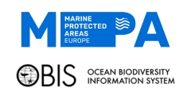

#  MPA Europe - Definition of the study area

OBIS/UNESCO is contributing with the MPA Europe project by predicting
the potential distribution of species and biogenic habitats, an
essential information to map the locations that would maximize the
conservation of species and ecosystems. You can know more about the [MPA
Europe project here](https://mpa-europe.eu) and [learn more about the
contribution of OBIS here](https://obis.org/2023/03/10/MPA_europe/).

## Defining the study area

Here is the code used to generate the shapefiles of the study area, to
ensure consistency between partners’ tasks. There are two files on the
**codes** folder: `study_area.R` is the main file to produce the study
area (see steps documented below); `generate_variants.R` is used to
generate other shapefiles of interest (e.g. a version projected to a
better CRS for plotting).

In progress:

- Create an expanded study area that will be the base for the SDMs (that
  is, considering nearby areas where species may also be present).

## Available files

Files are stored in **data/shapefiles** and are readily available in
three versions:

- `mpa_europe_starea_eez_v*.shp`: study area divided by the
  Marineregions classification (i.e. EEZs intersections with the IHO
  seas classification). You can group the features by both EEZs and IHO
  seas, thus providing a good tool for regional based analysis. More
  information on the Marineregions classification [can be found
  here.](https://www.marineregions.org/sources.php).
- `mpa_europe_starea_v*.shp`: study area aggregated as a single polygon.
  This is the main file for use by the MPA Europe teams.
- `mpa_europe_starea_laea3035_v*.shp`: study area reprojected for
  Lambert Azimuthal Equal Area projection (EPSG:3035). It’s the
  recommended projection for general plotting and presentation of
  results.
- `mpa_europe_starea_simple_v*.shp`: a simplified study area. Should be
  used only for plotting purposes when a simplified version is needed.

## How the shapefile was generated?

The study area was defined in the MPA Europe project, but a coherent
working shapefile was lacking. We generated one by first downloading the
Marineregions IHO/EEZ intersection map
(<https://www.marineregions.org/downloads.php#ihoeez>), so we could
filter by both EEZ and IHO seas, and an Europe map from NaturalEarth
(<https://www.naturalearthdata.com>).

    Thus, we intersected both areas to obtain those EEZ
correspondent to the study area. We further removed/added some areas
manually to reach the final result.

